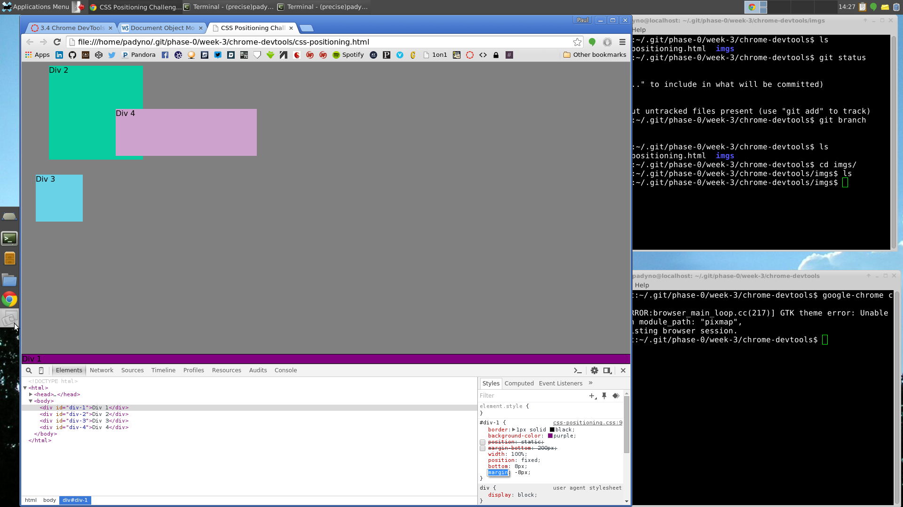

> 3.4.1:

> 3.4.2:

> 3.4.3:

> 3.4.4:

> 3.4.5:

> 3.4.6:

> 3.4.7:

> 3.4.8:

> 3.4.9:

> How can you use Chrome's DevTools inspector to help you format or position elements?

Chrome's DevTools inspector is useful for formatting and positioning elements because it allows you to, 1) make sure you're selecting the correct element for resizing and formatting, and 2) it allows you to make temporary changes within the browser tools to see what the specific changes in code will do to the display of the page. This is very convenient, because it allows you to see the results of your changes without having to reload the page or add/commit/push your files to the remote site and then bring them up from there.

> How can you resize elements on the DOM using CSS?

You can resize elements in the Document Object Model using CSS by referencing them by tag (most general,referring to all nodes of a given type of tag), class, or ID (most specific, referring only to a specific named node), and defining the dimensions of that element either explicitly (height: 50px) or by reference to the size of the screen (width: 50%)

> What are the differences between absolute, fixed, static, and relative positioning? Which did you find easiest to use? Which was most difficult?

Static: default setting, positioned according to the normal flow of the page - this is where an element goes without any direction to the contrary

Relative: positioned relative to the element's normal position - basically, relative positioning requires the coder to define how far away the element should be from the static, or default, position.

Fixed: positioned relative to the window you're viewing the elements through; stays in the same place even if the window is scrolled. 

Absolute: positioned according to the nearest ancestor (higher-level object in the DOM) that has been positioned (that is, that does not have a position: static property). If there are no ancestors that have been positioned, absolute instead references the document body itself. 

For our purposes today, we found fixed to be the easiest type of positioning to use, as you know right where the object will be at all times. We found absolute to be the most difficult, as it's not always obvious what an object's nearest positioned ancestor is, nor what a given change will do to the object of interest.

> What are the differences between margin, border, and padding?

Margin, border, and padding are components of the CSS box model of an HTML element. The specific content is the innermost layer, followed by padding, border, then finally margin. Padding is the clear space between the content and the inside of the border. Margin is clear space outside the border, between the border and any other elements. Furthermore, in addition to having a size property, the border can be styled (color, solid or dashed, etc) and made visible, while padding and margin are always transparent.

> What was your impression of the challenge overall? (love, hate, and why?)

Overall, I found this challenge to be interesting and, as usual with CSS, more difficult than I had expected. Definitely more on the love side than the hate side, although CSS does often seem to be insanely fiddly. It really did help to give me a better understanding of how to use both positioning and the box model to get a page to look like I want it to.
