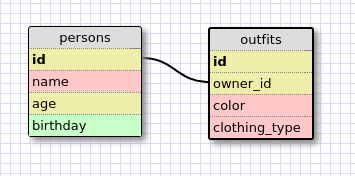

1. SELECT * FROM states;
2. SELECT * FROM regions;
3. SELECT state_name, population FROM states;
4. SELECT state_name, population FROM states ORDER BY population DESC;
5. SELECT state_name FROM states where region_id = 7;
6. SELECT state_name, population_density FROM states WHERE population_density
 \> 50 ORDER BY population_density ASC;

7. SELECT state_name FROM states WHERE population > 1000000 AND population  < 1500000;
8. SELECT state_name, region_id FROM states ORDER BY region_id;
9. SELECT region_name FROM regions WHERE region_name LIKE "%Central%";

10.  SELECT regions.region_name, states.state_name FROM states, regions WHERE states.region_id = regions.id ORDER BY regions.id;

OR 

10. SELECT state_name, regions.region_name FROM states INNER JOIN regions ON states.region_id = regions.id;

Here's an image of a potential schema for a persons/outfits database:

REFLECTIONS:

What are databases for?

>Databases are places to store data in a structured way to make it easier to
access and search.

What is a one-to-many relationship?

>A one-to-many relationship is a relationship in which "A has many B, and B
belongs to A" - for example, the United States has many states, and a state
belongs to the US.

What is a primary key? What is a foreign key? How can you determine which is which?

>A primary key is a piece of information that each entry in a database has,
and is unique to each entry. It must exist for each entry, and it cannot be
duplicated - sort of like a hash key in Ruby. A foreign key is a piece of
information that an entry MAY have, and refers to the primary key of another
table (for instance, in the problems above, the states.region_id field was a
foreign key - referring to the primary key in the regions table, the field
"id".

How can you select information out of an SQL database? What are some general
guidelines for that?

>You can select information from an SQL database by using the "SELECT info
FROM database" command, modified by many, many things. "info" can either be a
specific column or columns from the database, a general search for all
columns. Results can also be filtered using the WHERE command and defining
conditions for the entries to meet to be included (eg, a year prior to 1999; a
name that CONTAINS a certain string of letters, etc). The data can also be
sorted using the ORDER BY command. A general guideline, I guess, would be to
make the filter as specific as possible.

