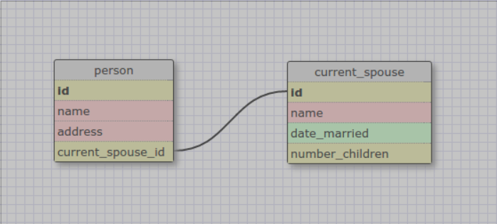

This relationship is one-to-one because each person in the initial table can
only have a single current spouse. It's better to use a one-to-one assignment
for this because you can then store other information about the spouse in the
spouse table, keeping the information about the separate people contained in
separate objects.

What is a one-to-one database? Why would you use one?

>A one-to-one database is a database in which paired information is kept in
two separate tables, where members of the first table can be related to (at
most) one of the members of the second table. It's often better to separate
information this way if you want to preserve additional information about the
second object.

What is a many-to-many database?

>A many-to-many database is a database structure where two distinct tables are
linked in a join table that references the primary keys of the original
tables; for instance, there might be a many-to-many table set up to keep track
of what books are owned by which people - a person can own many books, and a
particular book can be owned by many people. The most basic form just has its
own primary key, and foreign keys referencing each other table, but other
information can be included as well.

What is confusing about database schemas? What makes sense?

>They're pretty sensible, given a couple of minutes to think about them -
primary keys, columns for important information... mostly, things aren't
confusing, although care definitely has to be taken when designing the tables
to make sure that information isn't repeated in multiple places and that the
foreign keys are all pointing to the right place.
